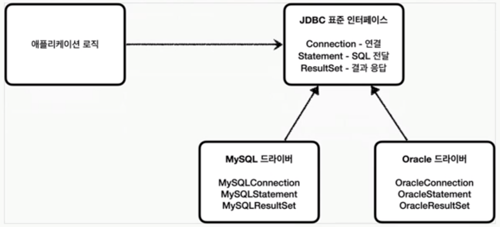

# JDBC 이해

## 목차

1. JDBC 이해
2. JDBC와 최신 데이터 접근 기술
3. 데이터베이스 연결
4. JDBC 개발 - 등록
5. JDBC 개발 - 조회
6. JDBC 개발 - 수정, 삭제
7. 정리

------

## 1. JDBC 이해

### JDBC 등장 이유

1. 애플리케이션을 개발할 때 중요한 정보는 데이터 베이스에 저장한다.
2. 일반적인 사용법
   1. 커넥션 연결: 주로 TCP/IP를 사용해서 커넥션을 연결한다.
   2. SQL 전달: 애플리케이션 서버는 DB가 이해할 수 있는 SQL을 연결된 커넥션을 통해 전달한다.
   3. 결과 응답: DB는 수행한 SQL의 결과를 응답한다. 애플리케이션은 응답 내용을 활용한다.
3. 그러나 DB마다 사용방법이 다르다.
   - 각각의 DB마다 커넥션 연결 방법, SQL 전달 방법, 결과 응답 방법이 다른다.
   - 참고로 RDB는 수십개가 있다.
4. 따라서 DB를 바꾸면, 서버에 개발된 DB 사용코드도 같이 변경해야 한다.
5. 또한 개발자는 DB마다 커넥션 연결 방법, SQL 전달 방법, 결과 응답 방법을 새로 익혀야 한다.

### JDBC 표준 인터페이스

- JDBC(Java DataBase Connectivity) 는 자바에서 DB를 연결할 수 있는 표준 API이다.

- 대표적으로 다음 3가지 기능을 표준 인터페이스로 정의해서 제공한다.
  - java.sql.Connection - 연결
  - java.sql.Statement - SQL을 담은 내용
  - java.sql.ResultSet - SQL 요청 응답
- 자바는 이렇게 표준 인터페이스를 정의해두었다. 이제부터 개발자는 이 표준 인터페이스만 사용해서 개발하면 된다.
- 하지만 인터페이스만 있다고해서 기능이 동작하지는 않는다. 인터페이스에 각각의 DB벤터에서 자신의 DB에 맞도록 구현해서 라이브러리로 제공하는데, 이것을 **JDBC 드라이버**라 한다.

### 정리

- JDBC의 등장으로 다음 2가지 문제가 해결되었다.
  1. 데이터베이스를 다른 종류의 데이터베이스로 변경하면 애플리케이션 서버의 데이터베이스 사용 코드도 함께 변경해야 하는 문제
     - 애플리케이션 로직은 이제 JDBC 표준 인터페이스에만 의존한다.
  2. 개발자각 각각의 데이터베이스마다 커넥션 연결, SQL 전달, 그리고 그 결과를 응답 받는 방법을 새로 학습해야하는 문제
     - 개발자는 JDBC 표준 인터페이스 사용법만 학습하면 된다.

### 한계

- JDBC의 등작으로 많은 것이 편리해졌지만, 각각의 데이터베이스마다 SQL, 데이터타입 등의 일부 사용 방법이 다르다.
- ANSI SQL이라는 표준이 있기는 하지만 일반적인 부분만 공통화했기 때문에 한계가 있다.
- 결국 데이터베이스를 변경하면 JDBC 코드는 변경하지 않아도 되지만, SQL은 해당 데이터베이스에 맞도록 변경해야 한다.

## 2. JDBC와 최신 데이터 접근 기술

## 3. 데이터베이스 연결

## 4. JDBC 개발 - 등록

## 5. JDBC 개발 - 조회

## 6. JDBC 개발 - 수정, 삭제

## 7. 정리